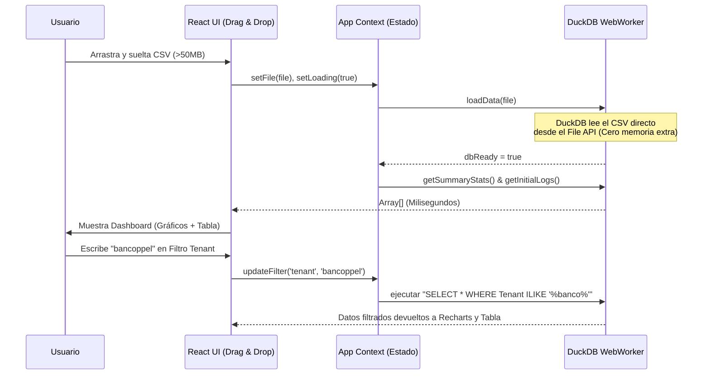

# 🏛️ Master Architecture Plan: MuleSoft Audit Log Analyzer

## 1. Visión General del Proyecto
El objetivo es construir una **Single Page Application (SPA)** de grado empresarial para auditar, filtrar y visualizar los *Audit Logs* (Archivos CSV) de MuleSoft. 
El sistema debe procesar localmente archivos pesados (>50MB) de forma instantánea sin requerir un servidor backend. La interfaz de usuario debe ser "Premium", moderna, reactiva y no bloquearse nunca bajo altas cargas de datos.

---

## 2. Definición del Stack Tecnológico (Core)
Para lograr un rendimiento extremo y mantener el código mantenible, el sistema se construirá estrictamente con las siguientes tecnologías:
*   **Framework:** React 18 inicializado con Vite (Ultra rápido).
*   **Motor Analítico (In-Browser):** `@duckdb/duckdb-wasm`. Esta es la joya de la corona. Permite montar una base de datos columnar dentro de la memoria RAM del navegador y ejecutar SQL (ej. `SELECT * FROM log WHERE Tenant = 'bancoppel'`) en milisegundos.
*   **Estilado:** Vanilla CSS (Variables globales y CSS Modules para encapsulamiento) garantizando control absoluto de animaciones *Glassmorphism* y Dark Mode.
*   **Visualización:** `recharts` (para gráficos interactivos) y `lucide-react` (para iconografía).
*   **Optimización de UI:** Renderizado virtualizado para tablas con miles de filas (ej. `@tanstack/react-virtual` o implementación manual eficiente).

---

## 3. Flujo de Datos y Arquitectura de Eventos



---

## 4. Estructura Exacta de Directorios (`src/`)

```text
src/
├── assets/                 # Imágenes, videos de demo, fuentes
├── components/             # Componentes de UI reutilizables
│   ├── common/             # Botones, Inputs, Cards con estilos Glassmorphism
│   ├── dashboard/          # KpiCards, ChartActions, TimelineChart
│   └── tables/             # AuditTable (Tabla de logs de alto rendimiento)
├── context/                # Manejo de Estado Global
│   └── AppContext.jsx      # Estado de la base de datos, archivo cargado, filtros actuales
├── db/                     # Capa de abstracción de Datos
│   ├── duckdb-service.js   # Lógica de inicialización de WebAssembly y lectura del archivo
│   └── queries.js          # Queries SQL predefinidos (ej. getActionsByUser, getLogsPaginated)
├── styles/                 # Sistema de Diseño Global
│   ├── variables.css       # Tokens de color, tipografía, z-index (Dark Mode Premium)
│   ├── global.css          # Resets, scrollbars personalizadas, utilidades base
│   └── layout.css          # Estilos estructurales principales
├── utils/                  # Funciones de ayuda
│   └── formatters.js       # Formateo de fechas, bytes a MB, capitalización
├── App.jsx                 # Controlador principal (Router básico o Conditional Rendering)
└── main.jsx                # Punto de entrada de React
```

---

## 5. Diseño de Interfaz y Estética Premium (UI/UX)
Para cumplir con la directiva de diseño "WOW", el sistema debe implementar:
1.  **Paleta de Colores (Dark Mode Premium):**
    *   `--bg-base`: `#0B0F19` (Azul oscuro ultra-profundo, casi negro).
    *   `--bg-surface`: `rgba(17, 24, 39, 0.65)` (Fondos de tarjetas).
    *   `--accent-primary`: `#3B82F6` (Azul neón brillante para acciones clave).
    *   `--text-primary`: `#F8FAFC`.
2.  **Efectos Visuales:**
    *   **Glassmorphism:** Las tarjetas del dashboard deben usar `backdrop-filter: blur(16px)` y bordes sutiles `border: 1px solid rgba(255, 255, 255, 0.08)`.
    *   **Gradients:** Textos importantes o íconos pueden tener `background-clip: text` con un gradiente sutil de azul a morado.
3.  **Animaciones:** Transiciones suaves (`transition: all 0.2s ease`) en botones y filas de la tabla al hacer `hover`.

---

## 6. Instrucciones Estrictas para el Desarrollo (Para Gemini 3 Fast / IA)

Cuando la IA asuma el desarrollo, **DEBE** seguir estos pasos en orden secuencial:

### PASO 1: Setup Core y Estilos
1. Inicializar las variables globales en `src/styles/variables.css`.
2. Crear el cascarón principal en `App.jsx` que alterne entre dos vistas: `<UploadView />` y `<DashboardView />`.

### PASO 2: Integración de DuckDB (La parte crítica)
1. Construir `src/db/duckdb-service.js`. Debe exportar una clase o funciones asíncronas para instanciar el Worker de `@duckdb/duckdb-wasm`.
2. Crear la función `importCSV(file)` que ejecute la query SQL: `CREATE TABLE logs AS SELECT * FROM read_csv_auto('file_name');`.
3. Manejar cualquier error de lectura y notificar a la UI.

### PASO 3: Vista de Subida (Upload View)
1. Crear un componente de Drag & Drop (`UploadArea.jsx`) elegante. Debe ocupar gran parte de la pantalla, cambiar de color al arrastrar un archivo, y mostrar el tamaño del archivo detectado.

### PASO 4: Dashboard y Lógica de Consultas
1. Construir `src/db/queries.js`. Ejemplo de query a implementar: 
   `SELECT "User Name", COUNT(*) as count FROM logs GROUP BY "User Name" ORDER BY count DESC LIMIT 5;`
2. Conectar el componente de gráficos de `Recharts` a estos datos devueltos por DuckDB.

### PASO 5: Tabla y Filtros
1. Crear una tabla de datos robusta.
2. Implementar inputs de texto y menús desplegables para filtrar por "Action", "Tenant" (que usualmente viene en el string de username en Mulesoft como *user_Tenant*), y Rango de Fechas.

---

## 7. Criterios de Calidad y Rendimiento Absolutos
> [!IMPORTANT]
> **REGLAS INQUEBRANTABLES DURANTE LA CODIFICACIÓN:**
> *   **Poder y Velocidad Extrema:** El sistema DEBE ser poderoso y cargar archivos inmensos (>50MB) casi instantáneamente. Se debe usar exclusivamente la lectura nativa de `DuckDB-WASM` para indexar el CSV a máxima velocidad sin cuellos de botella.
> *   **Arquitectura de Columnas Dinámicas (Anti-Fragilidad):** Los Audit Logs de MuleSoft cambian de formato (los usuarios pueden elegir hasta 15 columnas distintas). El código **JAMÁS** debe asumir que una columna existe. Usa `PRAGMA table_info('logs')` para extraer las columnas reales del CSV en tiempo de ejecución, y usa ese array para renderizar los encabezados de la tabla y armar las sentencias SQL dinámicamente.
> *   **Nunca bloquear el Main Thread:** El procesamiento pesado ocurre DENTRO de DuckDB con Web Workers. La UI debe mantener 60 FPS.
> *   **No reinventar la rueda con SQL:** En lugar de mapear y filtrar Arrays gigantes de JS con `.filter().map()`, usa sentencias SQL enviadas a DuckDB. Es 100x más rápido.
> *   **No se aceptan Placeholders Visuales Básicos:** Todo el CSS debe estar pulido con estilo Premium. Usar `lucide-react` para iconos.
